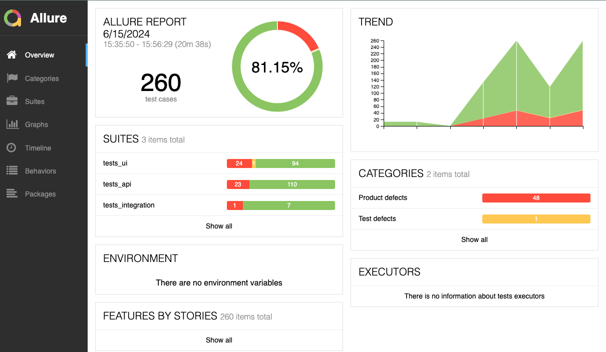
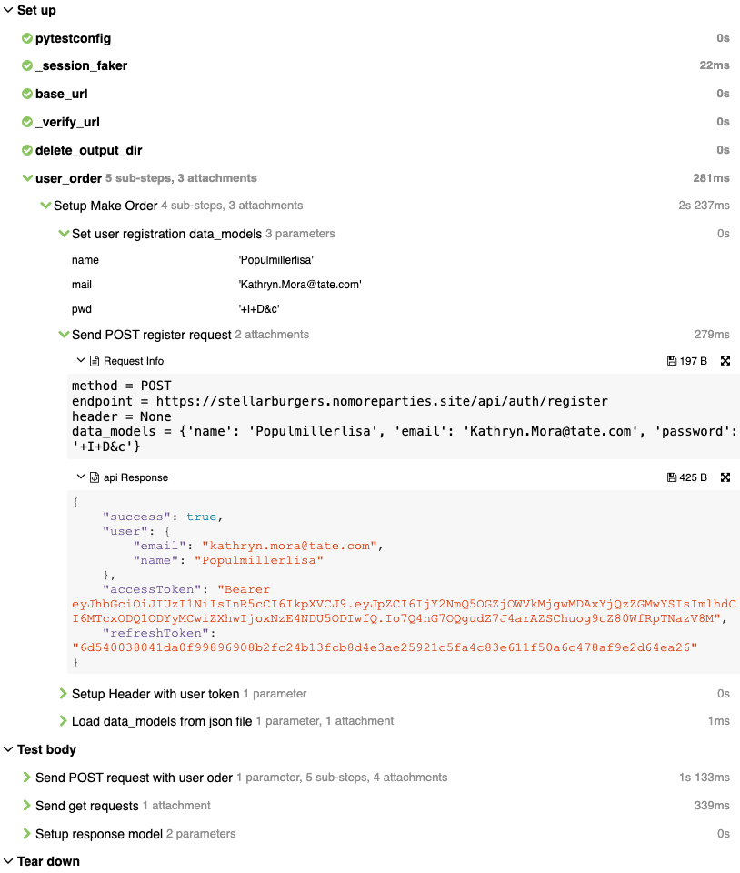
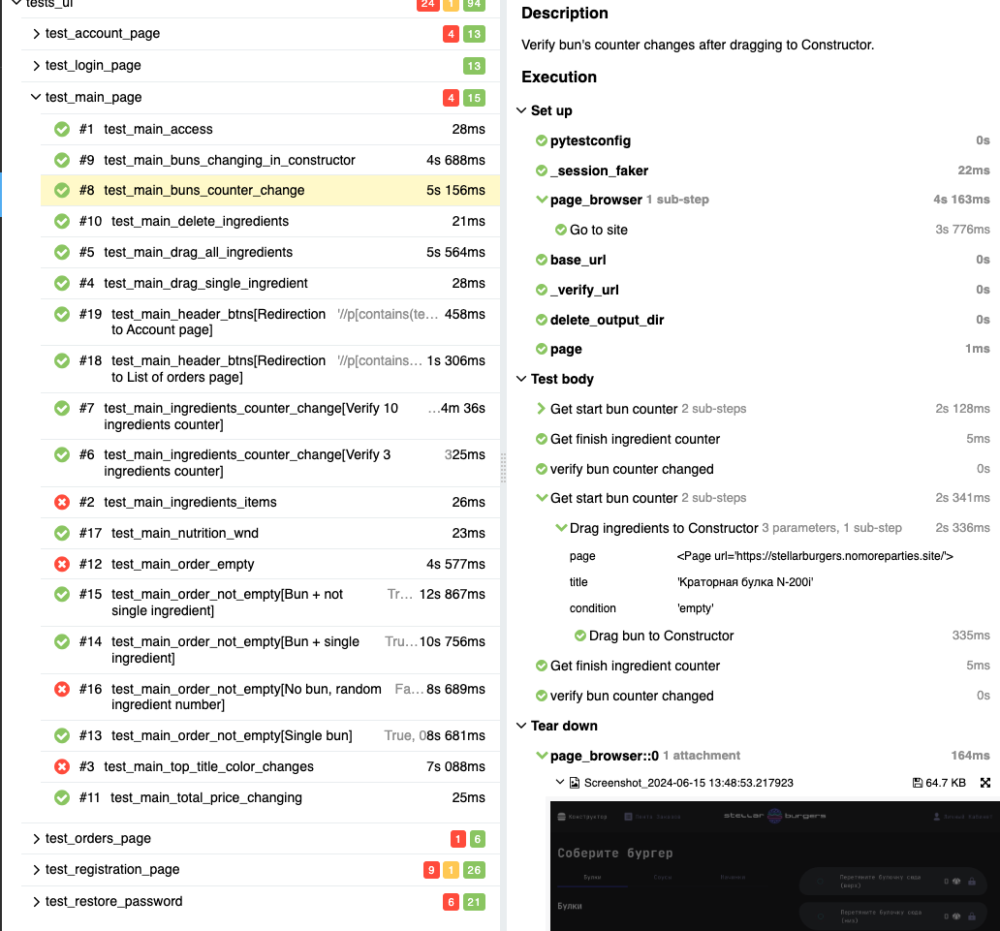

## Automated Testing Project Demo

This is a demo project showcasing various skills in test automation.

## Test Resource: [Stellar Burgers](https://stellarburgers.nomoreparties.site/)

UI tests use the Chromium browser in incognito mode.

The project utilizes Docker

Base image: python:3.11-slim.

  
LINTERS: 

  - flake8
  - pylint

  
LIBRARIES:

  
  - Programming language: Python 3.11
  - Browser framework: Playwright
  - API requests: Requests
  - Data validation: Pydantic
  - Reporting: Allure
  - Test data: Faker

## Test Details
- Total tests: 260
- Execution time: ~35 min

## Checklists

UI CHECKLIST

### Login page.
- Verify access to Login page.
- Verify direct access to Login page.
- Verify sign in with empty user credentials.
- Verify sign in with Not registered email, empty password.
- Verify sign in with Not registered email, with password < 6.
- Verify sign in with Not registered email, with password = 6.
- Verify sign in with Valid email, invalid password = 6.
- Verify sign in with Valid email, invalid password < 6.
- Verify sign in with valid user credentials.
- Verify redirection to pages using Header buttons (Register page).
- Verify redirection to pages using Header buttons (Forgot password page).
- Verify redirection to pages using Header buttons (List of orders page).
- Verify redirection to pages using Header buttons (Main page).
### Main page.
- Verify access to Main page.
- Verify all ingredients items presence on Main page.
- Verify top titles color changes when scrolling.
- Verify user can drag a single ingredient to Constructor.
- Verify user can drag all ingredient to Constructor.
- Verify ingredients counter changes after dragging 3 ingredients to Constructor.
- Verify ingredients counter changes after dragging 10 ingredients to Constructor.
- Verify bun's counter changes after dragging to Constructor.
- Verify buns change in Construction.
- Verify user can delete an ingredient from Construction.
- Verify total price changes according to the ingredients in the order.
- Verify order empty.
- Verify order with Single bun.
- Verify order with Bun + single ingredient.
- Verify order with Bun + not single ingredient.
- Verify order with No bun, random ingredient number.
- Verify all ingredient title open window with Nutrition.
- Verify redirection to pages using Header buttons (List of orders).
- Verify redirection to pages using Header buttons (Account page).
### Orders page.
- Verify access to Orders page.
- Verify direct access to Orders page.
- Verify order items have Info window.
- Verify new order added to in progress.
- Verify transfer new order to ready.
- Verify presence of the order total price in order item.
- Verify changes in Total orders number and today orders number.
### Register page.
- Verify access to Register page.
- Verify direct access to Register page.
- Verify registration with Empty user credentials.
- Verify registration with Empty login.
- Verify registration with Empty email.
- Verify registration with Empty password.
- Verify presence of error message if password less than 6 chars.
- Verify registration with a different password length (< 6).
- Verify registration with a different password length (100).
- Verify registration with a different password length (10).
- Verify registration with a different invalid name values (1 char).
- Verify registration with a different invalid name values (10 digits).
- Verify registration with a different invalid name values (special chars).
- Verify registration with a different invalid name values (100 char).
- Verify registration with a different invalid name values (2 strings).
- Verify registration with a different invalid name values (3 strings).
- Verify registration with a different invalid name values (front space string).
- Verify registration with a different invalid name values (back space string).
- Verify registration with a different invalid email format (without "@").
- Verify registration with a different invalid email format (without domain part).
- Verify registration with a different invalid email format (without username part).
- Verify registration with a different email format (one dot in username).
- Verify registration with a different email format (two dots in username).
- Verify registration with a different email format (underscore in username).
- Verify registration with a different email format (three underscores in username).
- Verify registration with a different email format (dash in username).
- Verify registration with a different email format (three dashes in username).
- Verify registration with a different email format (dash and dot in username).
- Verify presence of the error message if invalid email format.
- Verify registration with valid user credentials.
- Verify presence of the error message if using exist user credentials.
- Verify LogIn of new registered user.
- Verify redirection to Login page click Entry link.
- Verify redirection to pages using Header buttons (List of orders page).
- Verify redirection to pages using Header buttons (Main page).
- Verify redirection to pages using Header buttons (Login page).
### Forgot-password page.
- Verify access to Forgot-password page.
- Verify direct access to Forgot-password page.
- Verify sending restore password link with invalid email (Empty email).
- Verify sending restore password link with invalid email (Not registered email).
- Verify sending restore password link with invalid email (Email without domain part).
- Verify sending restore password link with invalid email (Email without username part).
- Verify sending restore password link with invalid email (Random string).
- Verify sending restore password link with invalid email (Random number).
- Verify redirection to Login page clicking Entry link.
- Verify redirection to Reset page.
- Verify redirection to pages using Header buttons (from Forgot to List of orders page).
- Verify redirection to pages using Header buttons (from Forgot to Main page).
- Verify redirection to pages using Header buttons (from Forgot to Login page).
- Verify redirection to Login page.
- Verify no redirection with invalid credential.
- Verify no redirection with invalid credential.
- Verify no redirection with invalid credential.
- Verify user receive an email (Not registered email).
- Verify user receive an email (Registered email).
- Verify reset code structure in email.
- Verify user setup new password.
- Verify user sign in using new password.
- Verify redirection to pages using Header buttons (from Reset to List of orders page).
- Verify redirection to pages using Header buttons (from Reset to Main page).
- Verify redirection to pages using Header buttons (from Reset to Login page).

API CHECKLIST

### GET /ingredients:
- Verify response status code.
- Verify exist of payload in response.
- Verify number of ingredients.
- Verify values of ingredient items.
- Verify response code with invalid methods (POST: 404).
- Verify response code with invalid methods (PUT: 404).
- Verify response code with invalid methods (PATCH: 404).
- Verify status code with different type of headers (Content-Type: application/json; charset=utf-8: 200).
- Verify status code with different type of headers (Content-Type: None: 200).
- Verify status code with different type of headers (Content-Type: Application/Json: 200).
- Verify status code with different type of headers (Content-Type: APPLICATION/JSON: 200).
- Verify status code with different type of headers (Content-Type: APPLICATION/: 200).
- Verify status code with different type of headers (Content-Type: application/text: 200).
- Verify status code with different type of headers (Content-Type: application/html: 200).
- Verify status code with different type of headers (Content-Type: application/json, Authorization: "": 200).
- Verify status code with different type of headers (Content-Type: application/json, Authorization: "empty": 200).
- Verify status code with different type of headers (Content-Type: application/xml: 200).
### GET /orders/all:
- Verify response status code.
- Verify exist of payload in response.
- Verify types values in response.
- Verify number of orders.
- Verify response code with invalid methods (POST: 404).
- Verify response code with invalid methods (PUT: 404).
- Verify response code with invalid methods (PATCH: 404).
- Verify status code with different type of headers (Content-Type: application/json; charset=utf-8: 200).
- Verify status code with different type of headers (Content-Type: None: 200).
- Verify status code with different type of headers (Content-Type: Application/Json: 200).
- Verify status code with different type of headers (Content-Type: APPLICATION/JSON: 200).
- Verify status code with different type of headers (Content-Type: APPLICATION/: 200).
- Verify status code with different type of headers (Content-Type: application/text: 200).
- Verify status code with different type of headers (Content-Type: application/html: 200).
- Verify status code with different type of headers (Content-Type: application/json, Authorization: "": 200).
- Verify status code with different type of headers (Content-Type: application/json, Authorization: "empty": 200).
- Verify status code with different type of headers (Content-Type: application/xml: 200). 
### GET /auth/user:
- Verify response status code.
- Verify exist of payload in response.
- Verify types values in response.
- Verify user credentials in response.
- Verify response with invalid token (Empty token: 401).
- Verify response with invalid token (Invalid token: 401).
- Verify response code with invalid methods (POST: 403).
- Verify response code with invalid methods (PUT: 404).
### PATCH /auth/register:
- Verify response status code (email: 200).
- Verify response status code (name: 200).
- Verify response status code (password: 200).
- Verify exist of payload in response (email: 200).
- Verify exist of payload in response (name: 200).
- Verify exist of payload in response (password: 200).
- Verify types values in response (email: 200).
- Verify types values in response (name: 200).
- Verify types values in response (password: 200).
- Verify updates of user credentials (email: 200).
- Verify updates of user credentials (name: 200).
- Verify updates of user credentials (password: 200).
- Verify response with invalid token (email, Empty token: 401).
- Verify response with invalid token (email, Invalid token: 401).
- Verify response with invalid token (name, Empty token: 401).
- Verify response with invalid token (name, Invalid token: 401).
- Verify response with invalid token (password, Empty token: 401).
- Verify response with invalid token (password,Invalid token: 401).
- Verify response code with exist email patch.
### POST /auth/logout:
- Verify response status code.
- Verify exist of payload in response.
- Verify payload values in response.
- Verify response code with invalid token (Empty token: 401).
- Verify response code with invalid token (Invalid token: 401).
- Verify response with invalid token (Empty token: 401).
- Verify response with invalid token (Empty token: 401).
- Verify response code with invalid methods (GET: 404).
- Verify response code with invalid methods (PUT: 404).
- Verify response code with invalid methods (PATCH: 404).
### POST /orders:
- Verify response status code.
- Verify exist of payload in response. 
- Verify values type in response.
- Verify number of ingredients in response (Order with bun and 1 ingredient).
- Verify number of ingredients in response (Order with no bun and 3 ingredient).
- Verify different types of orders (Empty order: 400). 
- Verify different types of orders (Order with 1 bun and ingredients [1 to 10]: 200).
- Verify different types of orders (Order with 1 bun and 100 ingredients: 200).
- Verify different types of orders (Order with no bun and ingredients [1 to 10]: 200).
- Verify different types of orders (Order buns [1 to 5] and ingredients [1 to 5]: 200).
- Verify new user order in response (Single order).
- Verify new user order in response (3 orders).
- Verify new user order in response (20 order).
- Verify response error message with invalid token (Empty token).
- Verify response error message with invalid token (Invalid token).
- Verify changes of total and totalToday numbers. 
- Verify changes of total and totalToday numbers in all_orders.
- Verify price of order with bun.
- Verify response code with invalid token (Empty token: 401).
- Verify response code with invalid token (Invalid token: 401).
### POST /auth/register:
- Verify response status code.
- Verify exist of payload in response.
- Verify values type in response.
- Verify response code with empty credentials (No email: 403).
- Verify response code with empty credentials (No password: 403).
- Verify response code with empty credentials (No name: 403).
- Verify response code with empty credentials (All empty: 403).
- Verify response code with invalid types of method (GET: 404).
- Verify response code with invalid types of method (PUT: 404).
- Verify response code with invalid types of method (PATCH: 404).
- Verify response code with invalid type of body (None data_models: 403).
- Verify response code with invalid type of body (Invalid data_models: 403).
- Verify response code with different email (Email without "@": 400).
- Verify response code with different email (Email without domain part: 400).
- Verify response code with different email (Email without username part: 400).
- Verify response code with different email (Integer: 400).
- Verify response code with different email (Email with one dot in username: 200).
- Verify response code with different email (Email with two dots in username: 200).
- Verify response code with different email (Email with underscore in username: 200).
- Verify response code with different email (Email with three underscores in username: 200).
- Verify response code with different email (Email with dash in username: 200).
- Verify response code with different email (Email with three dashes in username: 200).
- Verify response code with different email (Email with dash and dot in username: 200).
- Verify response code with different password length (Password < 6: 404).
- Verify response code with different password length (Password = 100: 200).
- Verify response code with different name (User name with 1 char: 200).
- Verify response code with different name (User name with 10 digits: 404).
- Verify response code with different name (User name with special chars: 404).
- Verify response code with different name (User name with 100 char: 404).
- Verify response code with different name (User name with 2 strings: 404).
- Verify response code with different name (User name with 3 strings: 404).
- Verify response code with different name (User name with front space string: 404).
- Verify response code with different name (User name with back space string: 404).
- Verify response with exist user registration.
### POST /password-reset:
- Verify response status code.
- Verify exist of payload in response.
- Verify values in response.
- Verify reset code in email box (Not registered email).
- Verify reset code in email box (Registered email).
- Verify response code with invalid type of method (GET: 404).
- Verify response code with invalid type of method (PUT: 404).
- Verify response code with invalid type of method (PATCH: 404).

INTEGRATION CHECKLIST

- Verify JSON ingredients api data_models = UI data_models.
- Verify ingredient titles with view different values (single eng string).
- Verify ingredient titles with view different values (150 chars string).
- Verify normal view with twice more ingredients on the page.
- Verify order number changes.
- Verify UI SignIn with valid api registered user credentials.
- Verify UI SignIn with different API password registration (Password < 6).
- Verify UI SignIn with different API password registration (Password 100).

## Allure Report [Link:](https://eeefimov.github.io/demo/)

## Allure Report View:
### Main view:

### API report view:

### UI report view:
